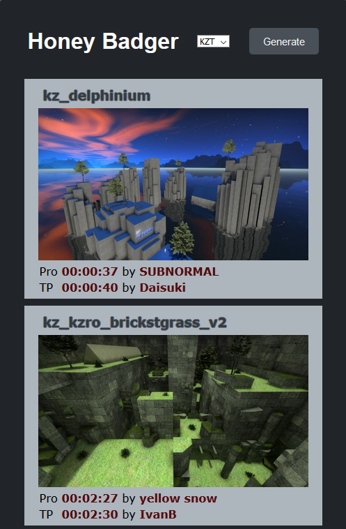

# honeybadger

**Version 1.0.0**



## Project setup
```
npm install
```

### Compiles and hot-reloads for development
```
npm run serve
```

### Compiles and minifies for production
```
npm run build
```

### Lints and fixes files
```
npm run lint
```
## Contributors

- Andreas Einwiller

## License & copyright

© Andreas Einwiller

Licensed under the [Apache License 2.0](LICENSE)
